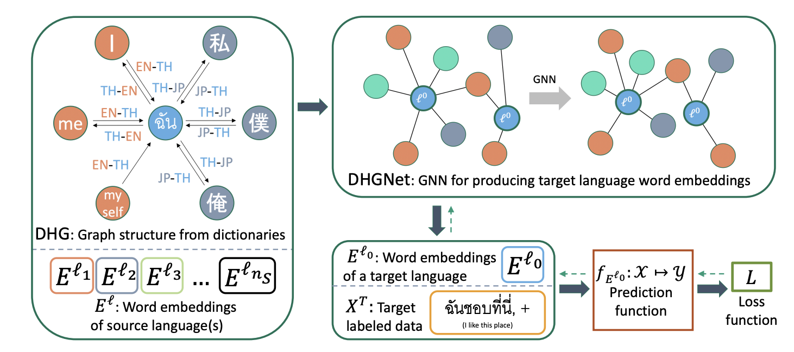

# DHGNet

Code repository for findings of EMNLP 2021 paper "Cross-lingual Transfer for Text Classification with Dictionary-based Heterogeneous Graph." [[arxiv]](https://arxiv.org/abs/2109.04400)

## Requirements

We tested the code on:
* python 3.6
* pytorch 1.9.0
* pytorch-geometric 1.7.2 (https://github.com/pyg-team/pytorch_geometric)
* fastai 1.0.61 (need to be v1: https://github.com/fastai/fastai1)
* embeddings (https://github.com/vzhong/embeddings)
* word2word (https://github.com/kakaobrain/word2word)

other requirements:
* numpy
* pandas
* scikit-learn
* gensim
* tqdm
* nltk
* pythainlp 2.3.1 (for Thai language tokenizer)

## Usage

1. Extract `data/text_cls.zip` file for datasets.

2. Run the code in `src` folder using the command for training and evaluating DHGNet<i>en</i>.

    * For Bosnian setting:\
    `python main.py bosnian --rnn_layers 1 --directed 0 --add_from_dict 30000 --name [output_model_name]` .

    * For other settings (`bengali`,`malayalam`,`tamil`,`thai_t`,`thai_w`):\
    `python main.py [setting_name] --name [output_model_name]` .

    * For DHGNet<i>multi</i>, add a command option `--langs ar,en,es,fa,fr,zh` .

Note that the code will automatically download source word-embeddings (default `fasttext`) which may take time and disk space.\
<b>Optionally</b>, you can download dump files that contain all related source word-embeddings for the aforementioned settings in https://1drv.ms/u/s!AkynV6rCKmmXkNBYwRchAWfurRkBrQ?e=NnOszA and put the files in folder `data/word_emb/fasttext_wiki`.\
Then run the code with an additional command option `--use_temp_only 1`\
** To run using only English as source, you can download only `en.db_temp.pkl`.